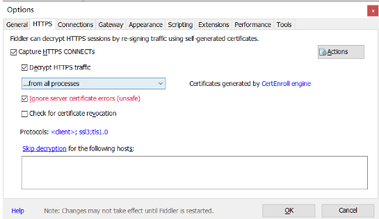
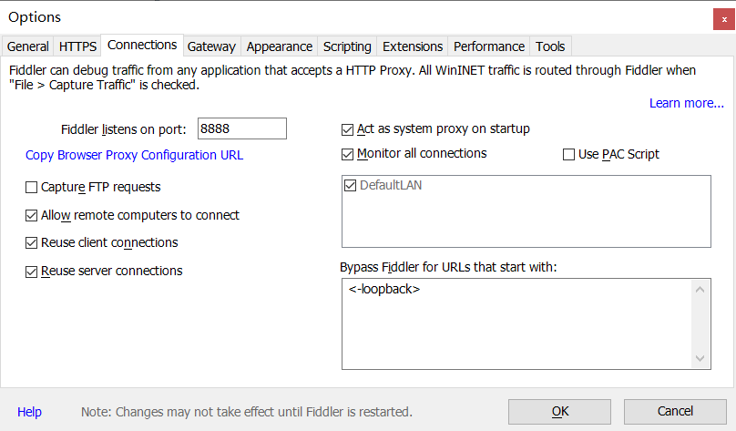
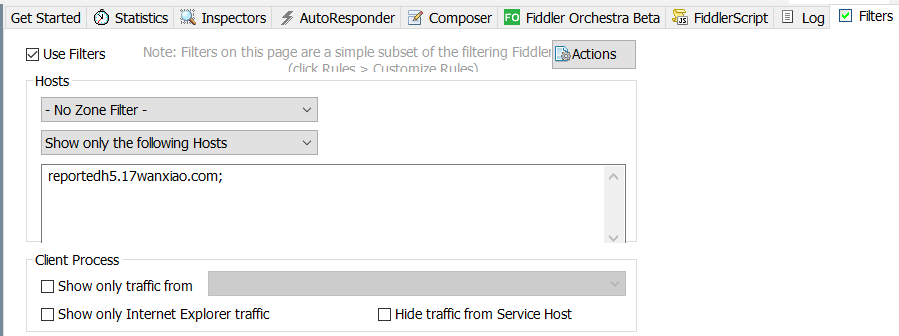
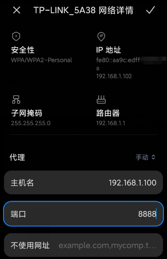
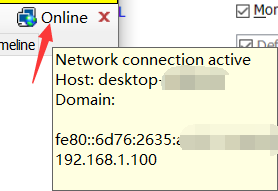
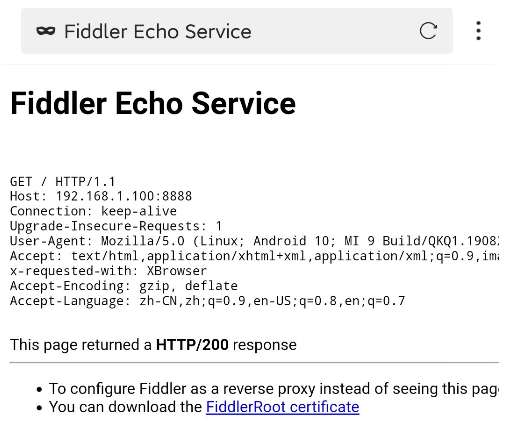

# EzCheckInSchool
完美校园自动健康打卡，基于Github Actions免服务器运行。

- 随机校内经纬度🗺️
- 打卡结果微信推送💬
- 随机温度(36.2℃-36.4℃)🌡
- 校内打卡三次:06:00,12:30,21:00🕑

**Github Actions定时任务可能出现几分钟的误差**

**首次开启将会打早间卡作为测试**

## 更新日志
2020.9.12 7:00 修复时间判断代码，现在将正常打卡三次

## 使用方法
首先，点击右上角Star并Fork，

接下来抓包完美校园打卡内容，本文使用Fiddler代理手机抓包

fiddler没有手机客户端，都是安装在PC上，要实现对手机上的程序抓包，则需要对PC上的fiddler和手机端做一些配置。

首先对PC端fiddler配置如下图：







设置完fliters后点击右侧Actions->Run Fliterset now

然后打开手机，连接到电脑同一Wifi下设置代理



此处的主机名可鼠标悬浮于Fiddler右上角Online图标查看



设置好代理后，使用手机浏览器打开上图中主机名+端口号，本例为192.168.1.100:8888（如果无法访问请把360之类的关掉）



点击FiddlerRoot certificate下载证书，下载完成后点击安装。

之后打开完美校园开始健康打卡（最好在指定的打卡时间打卡方便抓包，由于证书的原因，如果不显示打卡界面需要多尝试打开几次），目标数据包为POST到`https://reportedh5.17wanxiao.com/sass/api/epmpics`的JSON
格式如下：

```
{
	"businessType": "epmpics",
	"method": "submitUpInfoSchool",
	"jsonData": {
		"deptStr": {
			"deptid": xxxx,
			"text": "x学院-xx-xxxxxx"
		},
		"areaStr": "{\"streetNumber\":\"\",\"street\":\"x街\",\"district\":\"x区\",\"city\":\"x市\",\"province\":\"x省\",\"town\":\"\",\"pois\":\"xxxx\",\"lng\":xxx.,\"lat\":xxx,\"address\":\"x区x街x城\",\"text\":\"x省-x市\",\"code\":\"\"}",
		"reportdate": xxxxxxxxxx,
		"customerid": 43,
		"deptid": xxxx,
		"source": "app",
		"templateid": "clockSign3",
		"stuNo": "学号",
		"username": "姓名",
		"userid": 用户ID,
		"updatainfo": [
			{
				"propertyname": "temperature",
				"value": "36.4"
			},
			{
				"propertyname": "symptom",
				"value": "无症状"
			}
		],
		"customerAppTypeRuleId": 146,
		"clockState": 0
	},
	"token": "TOKEN字段"
}
```
**注意：本项目默认AERASTR为河南工业大学，其他学校请自行修改。**

AREASTR //抓包JSON中的"areaStr"，删去转义符‘\’，如

```
{"streetNumber":"","street":"x街","district":"x区","city":"x市","province":"x省","town":"","pois":"xxxx","lng":xxx,"lat":xxx,"address":"x区x街x城","text":"x省-x市","code":""}
```

接下来你需要把上面获取到的JSON依次设为Secert

在Settings添加以下Secert字段

DEPTID //抓包JSON中的"deptid"

DEPTTEXT //抓包JSON中的"jsonData"的"text"

STUNO //抓包JSON中的"stuNo"

USERID //抓包JSON中的"userid"

USERNAME //抓包JSON中的"username"

SCKEY //Server酱调用完整URL，以.send结尾，使用前请注册并绑定[Server酱](http://sc.ftqq.com/)

以上步骤都完成后开启Actions

Settings->Action->I understand... 

回到项目主页，修改README.md随便加几个空格即可触发Actions，设置完成打卡后打卡时间内会每天自动打卡三次，第一次使用请观察效果。

## 友情链接
https://github.com/ReaJason/17wanxiaoCheckin-Actions

https://github.com/YooKing/HAUT_autoCheck

https://github.com/LovelyWhite/Haut-AutoCheckin

